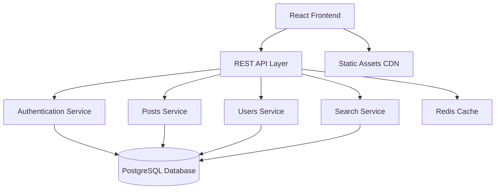

# Design Document - Introvirght

## Overview

Introvirght is a mindful social platform designed to foster authentic self-expression and meaningful connections through text-only content. The platform emphasizes a calming user experience with soft aesthetics, gentle interactions, and features that encourage thoughtful reflection. The architecture follows modern web development patterns with a focus on performance, scalability, and user well-being.

## Architecture

### High-Level Architecture



### Technology Stack

**Frontend:**
- React 18 with TypeScript for type safety and modern development
- Tailwind CSS for utility-first styling with custom calming color palette
- Framer Motion for smooth, gentle animations
- React Query for efficient data fetching and caching
- React Router for client-side navigation

**Backend:**
- Node.js with Express.js for the REST API
- TypeScript for consistent type safety across the stack
- PostgreSQL for reliable data persistence
- Redis for session management and caching
- JWT for secure authentication

**Infrastructure:**
- Vercel/Netlify for frontend deployment
- Railway/Heroku for backend hosting
- Cloudflare for CDN and security

## Components and Interfaces

### Core Components

#### 1. Authentication System
- **LoginForm**: Gentle login interface with soft validation feedback
- **RegisterForm**: Welcoming registration with inspirational messaging
- **AuthProvider**: Context provider for authentication state management

#### 2. Post Management
- **ComposeBox**: Distraction-free writing interface with calming prompts
- **PostCard**: Minimalist post display with subtle interaction elements
- **PostFeed**: Infinite scroll feed with gentle loading animations
- **PostActions**: Like and repost buttons with satisfying micro-interactions

#### 3. User Interface
- **UserProfile**: Clean profile layout emphasizing user's journey
- **UserCard**: Compact user representation for discovery
- **FollowButton**: Gentle follow/unfollow toggle with smooth transitions

#### 4. Navigation & Layout
- **Header**: Minimal navigation with soft branding
- **Sidebar**: Optional navigation panel with calming icons
- **Layout**: Consistent spacing and typography throughout

#### 5. Search & Discovery
- **SearchBar**: Intuitive search with gentle auto-suggestions
- **SearchResults**: Clean results layout with clear categorization
- **SuggestedUsers**: Thoughtful user recommendations

### API Interfaces

#### Authentication Endpoints
```typescript
POST /api/auth/register
POST /api/auth/login
POST /api/auth/logout
GET /api/auth/me
```

#### Posts Endpoints
```typescript
GET /api/posts/feed
POST /api/posts
GET /api/posts/:id
POST /api/posts/:id/like
POST /api/posts/:id/repost
DELETE /api/posts/:id
```

#### Users Endpoints
```typescript
GET /api/users/:username
PUT /api/users/profile
POST /api/users/:id/follow
DELETE /api/users/:id/follow
GET /api/users/:id/followers
GET /api/users/:id/following
```

#### Search Endpoints
```typescript
GET /api/search/users?q=:query
GET /api/search/posts?q=:query
GET /api/search/suggestions
```

## Data Models

### User Model
```typescript
interface User {
  id: string;
  username: string;
  email: string;
  bio?: string;
  createdAt: Date;
  updatedAt: Date;
  followerCount: number;
  followingCount: number;
  postCount: number;
}
```

### Post Model
```typescript
interface Post {
  id: string;
  content: string;
  authorId: string;
  author: User;
  createdAt: Date;
  updatedAt: Date;
  likeCount: number;
  repostCount: number;
  isLikedByCurrentUser?: boolean;
  isRepostedByCurrentUser?: boolean;
  originalPost?: Post; // For reposts
}
```

### Follow Relationship Model
```typescript
interface Follow {
  id: string;
  followerId: string;
  followingId: string;
  createdAt: Date;
}
```

### Like Model
```typescript
interface Like {
  id: string;
  userId: string;
  postId: string;
  createdAt: Date;
}
```

## Design System

### Color Palette (Calming Theme)
```css
:root {
  /* Primary calming colors */
  --sage-50: #f8faf8;
  --sage-100: #e8f2e8;
  --sage-200: #d1e5d1;
  --sage-300: #a8d0a8;
  --sage-500: #6b9b6b;
  --sage-700: #4a6b4a;
  
  /* Neutral tones */
  --stone-50: #fafaf9;
  --stone-100: #f5f5f4;
  --stone-200: #e7e5e4;
  --stone-400: #a8a29e;
  --stone-600: #57534e;
  --stone-800: #292524;
  
  /* Accent colors */
  --lavender-100: #f3f0ff;
  --lavender-300: #c4b5fd;
  --lavender-500: #8b5cf6;
}
```

### Typography
- **Primary Font**: Inter (clean, readable)
- **Accent Font**: Crimson Text (for inspirational quotes/prompts)
- **Font Sizes**: Fluid typography scale for accessibility
- **Line Height**: Generous spacing for comfortable reading

### Animation Principles
- **Duration**: 200-400ms for micro-interactions
- **Easing**: Gentle curves (ease-out, ease-in-out)
- **Loading**: Subtle skeleton screens and fade-ins
- **Transitions**: Smooth state changes without jarring effects

## Error Handling

### Client-Side Error Handling
- **Network Errors**: Gentle retry mechanisms with calming messaging
- **Validation Errors**: Soft, non-intrusive feedback
- **404 Pages**: Encouraging messages with navigation suggestions
- **Loading States**: Peaceful loading indicators

### Server-Side Error Handling
- **Input Validation**: Comprehensive validation with helpful error messages
- **Rate Limiting**: Gentle throttling with clear communication
- **Database Errors**: Graceful degradation with user-friendly messages
- **Authentication Errors**: Clear, non-threatening security messaging

### Error Response Format
```typescript
interface ErrorResponse {
  success: false;
  error: {
    code: string;
    message: string;
    details?: any;
  };
}
```

## Testing Strategy

### Frontend Testing
- **Unit Tests**: Jest + React Testing Library for component logic
- **Integration Tests**: User flow testing with realistic scenarios
- **Visual Tests**: Storybook for component documentation and visual regression
- **Accessibility Tests**: Automated a11y testing with axe-core

### Backend Testing
- **Unit Tests**: Jest for service and utility functions
- **Integration Tests**: Supertest for API endpoint testing
- **Database Tests**: Test database with realistic data scenarios
- **Performance Tests**: Load testing for scalability validation

### End-to-End Testing
- **User Journeys**: Playwright for critical user flows
- **Cross-Browser**: Testing across modern browsers
- **Mobile Testing**: Responsive design validation
- **Performance**: Core Web Vitals monitoring

### Testing Priorities
1. **Authentication flows** - Critical for security
2. **Post creation and display** - Core functionality
3. **Follow/unfollow mechanics** - Social features
4. **Search functionality** - Discovery features
5. **Responsive design** - Accessibility and usability

## Performance Considerations

### Frontend Optimization
- **Code Splitting**: Route-based and component-based splitting
- **Image Optimization**: WebP format with fallbacks (minimal usage)
- **Caching**: Aggressive caching for static assets
- **Bundle Size**: Tree shaking and minimal dependencies

### Backend Optimization
- **Database Indexing**: Optimized queries for feeds and search
- **Caching Strategy**: Redis for frequently accessed data
- **API Rate Limiting**: Protect against abuse while maintaining UX
- **Connection Pooling**: Efficient database connection management

### Monitoring
- **Core Web Vitals**: LCP, FID, CLS tracking
- **API Performance**: Response time monitoring
- **Error Tracking**: Comprehensive error logging
- **User Analytics**: Privacy-focused usage insights